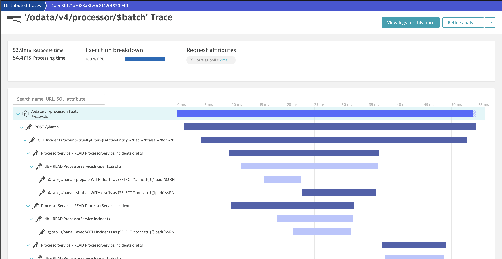

# Welcome to @cap-js/telemetry

[](https://api.reuse.software/info/github.com/cap-js/telemetry)


## About this project

`@cap-js/telemetry` is a CDS plugin providing observability features, including [automatic OpenTelemetry instrumentation](https://opentelemetry.io/docs/concepts/instrumentation/automatic).

Documentation can be found at [cap.cloud.sap](https://cap.cloud.sap/docs) and [opentelemetry.io](https://opentelemetry.io/docs).


## Table of Contents

- [About this project](#about-this-project)
- [Requirements](#requirements)
- [Setup](#setup)
- [Telemetry Signals](#telemetry-signals)
  - [Traces](#traces)
  - [Metrics](#metrics)
  - [Logs](#logs)
- [Predefined Kinds](#predefined-kinds)
  - [`telemetry-to-console`](#telemetry-to-console)
  - [`telemetry-to-dynatrace`](#telemetry-to-dynatrace)
  - [`telemetry-to-cloud-logging`](#telemetry-to-cloud-logging)
  - [`telemetry-to-jaeger`](#telemetry-to-jaeger)
- [Detailed Configuration Options](#detailed-configuration-options)
  - [Configuration Pass Through](#configuration-pass-through)
  - [Instrumentations](#instrumentations)
  - [Sampler](#sampler)
  - [Propagators](#propagators)
  - [Exporters](#exporters)
  - [Environment variables](#environment-variables)
- [Support, Feedback, Contributing](#support-feedback-contributing)
- [Code of Conduct](#code-of-conduct)
- [Licensing](#licensing)


## Requirements

See [Getting Started](https://cap.cloud.sap/docs/get-started) on how to jumpstart your development and grow as you go with SAP Cloud Application Programming Model.


## Setup

Simply add `@cap-js/telemetry` to your dependencies via `npm add @cap-js/telemetry` and you will find telemetry output written to the console like so:

```
[odata] - GET /odata/v4/processor/Incidents 
[telemetry] - elapsed times:
    0.00 →   2.85 =   2.85 ms  GET /odata/v4/processor/Incidents
    0.47 →   1.24 =   0.76 ms    ProcessorService - READ ProcessorService.Incidents
    0.78 →   1.17 =   0.38 ms      db - READ ProcessorService.Incidents
    0.97 →   1.06 =   0.09 ms        @cap-js/sqlite - prepare SELECT json_object('ID',ID,'createdAt',createdAt,'creat…
    1.10 →   1.13 =   0.03 ms        @cap-js/sqlite - stmt.all SELECT json_object('ID',ID,'createdAt',createdAt,'crea…
    1.27 →   1.88 =   0.61 ms    ProcessorService - READ ProcessorService.Incidents.drafts
    1.54 →   1.86 =   0.32 ms      db - READ ProcessorService.Incidents.drafts
    1.74 →   1.78 =   0.04 ms        @cap-js/sqlite - prepare SELECT json_object('ID',ID,'DraftAdministrativeData_Dra…
    1.81 →   1.85 =   0.04 ms        @cap-js/sqlite - stmt.all SELECT json_object('ID',ID,'DraftAdministrativeData_Dr…
```

See [Predefined Kinds](#predefined-kinds) for additional dependencies you need to bring yourself as well as some additional setup steps you need to perform when exporting to Dynatrace, SAP Cloud Logging, Jaeger, etc.

The plugin can be disabled by setting environment variable `NO_TELEMETRY` to something truthy.

Database tracing is currently limited to [@cap-js/sqlite](https://www.npmjs.com/package/@cap-js/sqlite) and [@cap-js/hana](https://www.npmjs.com/package/@cap-js/hana).


## Telemetry Signals

There are three categories of telemetry data, also referred to as _signals_.
The following briefly describes, how each is addressed in `@cap-js/telemetry`.

For more information on signals in general, please refer to https://opentelemetry.io/docs/concepts/signals.

### Traces

Traces allow you to analyze how a request, message, task, etc. is being processed throughout your distributed system.
For this, `@cap-js/telemetry` wraps all essential functions of `cds.Service` and its derivates.
For @cap-js databases (e.g., `@cap-js/sqlite`), this includes `prepare()` and subsequent `stmt.run()` and the likes.

Example trace in Dynatrace:


An example trace printed to the console can be found in [`telemetry-to-console`](#telemetry-to-console).

In environments where Dynatrace OneAgent is installed (e.g., SAP BTP CF), no OpenTelemetry exporter is needed to transport the traces to Dynatrace.
`@cap-js/telemetry` recognizes this and ignores any exporter config if the predefined kind [`telemetry-to-dynatrace`](#telemetry-to-dynatrace) is used.

### Metrics

Metrics are "measurements captured at runtime", which help you understand your app's health and performance.

Out of the box, `@cap-js/telemetry` offers metrics regarding the app's database pool, namely the [pool info](https://www.npmjs.com/package/generic-pool#pool-info) statistics of `generic-pool`.

Example db pool metrics printed to the console:
```
[telemetry] - db.pool:
     size | available | pending
      1/1 |       1/1 |       0
```

Additionally, `@cap-js/telemetry` instantiates and starts [`@opentelemetry/host-metrics`](https://www.npmjs.com/package/@opentelemetry/host-metrics) if it is found in the app's dependencies.

Currently, there is no public config option to influence which metrics `@opentelemetry/host-metrics` collects.
However, it is possible to instruct the meter provider during initialization, which metrics shall be ignored.
By default, this is done for all `system.*` metrics collected by `@opentelemetry/host-metrics`.
This can be disabled via environment variable `HOST_METRICS_RETAIN_SYSTEM=true`.
As these so-called *views* must be passed into the constructor, the above only applies in case `@cap-js/telemetry` initializes the meter provider.

To avoid spamming the console, only `process.*` metrics are printed by default, regardless of whether the `system.*` metrics are ignored or not.
Printing the `system.*` metrics (if not ignored) in the built-in console exporter can be enabled via environment variable `HOST_METRICS_LOG_SYSTEM=true`.

Example host metrics printed to the console:
```
[telemetry] - host metrics:
  Process Cpu time in seconds: { user: 1691.832, system: 218.223 }
  Process Cpu usage time 0-1: { user: 82.07801878654074, system: 10.586932682237526 }
  Process Memory usage in bytes: 141049856
```

Finally, custom metrics can be added as shown in the following example (tenant-aware request counting):
```js
// server.js

const cds = require('@sap/cds')

let counter
cds.middlewares.add((req, _, next) => {
  counter.add(1, { 'sap.tenancy.tenant_id': req.tenant })
  next()
})
cds.on('listening', () => {
  const { metrics } = require('@opentelemetry/api')
  const meter = metrics.getMeter('@capire/incidents:req.counter')
  counter = meter.createCounter('req.counter')
})

module.exports = cds.server
```

### Logs

Exporting logs via OpenTelemetry is not yet supported.


## Predefined Kinds

There are three predefined kinds as follows:

### `telemetry-to-console`

Prints traces and metrics to the console as previously depicted (traces in [Setup](#setup) and metrics in [Telemetry Signals - Metrics](#metrics)).

No additional dependencies are needed.
This is the default kind in both development and production.

### `telemetry-to-dynatrace`

Exports traces and metrics to Dynatrace.
Hence, a Dynatrace instance is required and the app must be bound to that Dynatrace instance.

Use via `cds.requires.telemetry.kind = 'to-dynatrace'`.

Required additional dependencies:
- `@opentelemetry/exporter-trace-otlp-proto` (optional, see [Leveraging Dynatrace OneAgent](#leveraging-dynatrace-oneagent))
- `@opentelemetry/exporter-metrics-otlp-proto`

The necessary scopes for exporting traces (`openTelemetryTrace.ingest`) and metrics (`metrics.ingest`) are not part of the standard `apitoken` and must be requested.
This can be done via parameterizing the binding to a "managed service instance" (i.e., not a user-provided service instance) as follows.

Excerpt from example mta.yaml:
```yaml
requires:
  - name: my-dynatrace-instance
    parameters:
      config:
        tokens:
          - name: ingest_apitoken #> default lookup name, configurable via cds.requires.telemetry.token_name
            scopes:
              - openTelemetryTrace.ingest
              - metrics.ingest
```

In the user-provided service case, you'll need to generate a token in Dynatrace with the necessary scopes, add it to the credentials of the user-provided service, and configure `cds.requires.telemetry.token_name` if the token's key in the credentials object is not `ingest_apitoken`.

In Dynatrace itself, you need to ensure that the following two features are enabled:
1. OpenTelemetry Node.js Instrumentation agent support:
    - From the Dynatrace menu, go to Settings > Preferences > OneAgent features.
    - Find and turn on OpenTelemetry Node.js Instrumentation agent support.
2. W3C Trace Context:
    - From the Dynatrace menu, go to Settings > Server-side service monitoring > Deep monitoring > Distributed tracing.
    - Turn on Send W3C Trace Context HTTP headers.

#### Leveraging Dynatrace OneAgent

If [Dynatrace OneAgent](https://www.dynatrace.com/platform/oneagent) is present, for example on SAP BTP CF, it will collect and transport the traces created by `@cap-js/telemetry` automatically.
(Your app still needs to be bound to a Dynatrace instance, of course. However, `@dynatrace/oneagent-sdk` is not required.)
Hence, additionally dependency `@opentelemetry/exporter-trace-otlp-proto` and scope `openTelemetryTrace.ingest` are not required.
This is actually the perferred operating model for `telemetry-to-dynatrace` as it provides a better experience than exporting via OpenTelemetry.
If dependency `@opentelemetry/exporter-trace-otlp-proto` is present anyway, `@cap-js/telemetry` will export the traces via OpenTelemetry as well.

### `telemetry-to-cloud-logging`

Exports traces and metrics to SAP Cloud Logging.
Hence, a SAP Cloud Logging instance is required and the app must be bound to that SAP Cloud Logging instance.

Use via `cds.requires.telemetry.kind = 'to-cloud-logging'`.

Required additional dependencies:
- `@grpc/grpc-js`
- `@opentelemetry/exporter-trace-otlp-grpc`
- `@opentelemetry/exporter-metrics-otlp-grpc`

In order to receive OpenTelemetry credentials in the binding to the SAP Cloud Logging instance, you need to include the following configuration while creating the SAP Cloud Logging instance (or by updating an existing instance):
```json
{
  "ingest_otlp": {
    "enabled": true
  }
}
```

### `telemetry-to-jaeger`

Exports traces to Jaeger.

Use via `cds.requires.telemetry.kind = 'to-jaeger'`.

Required additional dependencies (As Jaeger does not support metrics, only a trace exporter is needed.):
- `@opentelemetry/exporter-trace-otlp-proto`

Provide custom credentials like so:
```jsonc
{
  "cds": {
    "requires": {
      "telemetry": {
        "kind": "to-jaeger",
        "tracing": {
          "exporter": {
            "config": { //> this object is passed into constructor as is
              // add credentials here as decribed in
              // https://www.npmjs.com/package/@opentelemetry/exporter-trace-otlp-proto
            }
          }
        }
      }
    }
  }
}
```

Run Jaeger locally via [docker](https://www.docker.com):
- Run `docker run -d --name jaeger -e COLLECTOR_ZIPKIN_HOST_PORT=:9411 -e COLLECTOR_OTLP_ENABLED=true -p 6831:6831/udp -p 6832:6832/udp -p 5778:5778 -p 16686:16686 -p 4317:4317 -p 4318:4318 -p 14250:14250 -p 14268:14268 -p 14269:14269 -p 9411:9411 jaegertracing/all-in-one:latest`
    - With this, no custom credentials are needed
- Open `localhost:16686` to see the traces


## Detailed Configuration Options

### Configuration Pass Through

In general, you can influence the configuration of a used module via the respective `config` node in `cds.env.requires.telemetry`.
For example, it is possible to specify the `temporalityPreference` setting of the respective metrics exporter like so:
```jsonc
{
  "cds": {
    "requires": {
      "telemetry": {
        "metrics": {
          "exporter": {
            "config": { //> this object is passed into constructor as is
              "temporalityPreference": "DELTA"
            }
          }
        }
      }
    }
  }
}
```

### Instrumentations

Configure via `cds.requires.telemetry.instrumentations = { <name>: { module, class, config? } }`

Default:
```json
{
  "http": {
    "module": "@opentelemetry/instrumentation-http",
    "class": "HttpInstrumentation",
    "config": {
      "ignoreIncomingPaths": [
        "/health"
      ]
    }
  }
}
```

### Sampler

Configure via `cds.requires.telemetry.tracing.sampler = { kind, root?, ratio? }`

Default:
```json
{
  "kind": "ParentBasedSampler",
  "root": "AlwaysOnSampler"
}
```

### Propagators

Configure via `cds.requires.telemetry.tracing.propagators = [<name> | { module, class, config? }]`

Default:
```json
["W3CTraceContextPropagator"]
```

### Exporters

Configure via:
- `cds.requires.telemetry.tracing.exporter = { module, class, config? }`
- `cds.requires.telemetry.metrics.exporter = { module, class, config? }`

Default:
```json
{
  {
    "kind": "telemetry-to-console",
    "tracing": {
      "module": "@cap-js/telemetry",
      "class": "ConsoleSpanExporter"
    },
    "metrics": {
      "module": "@cap-js/telemetry",
      "class": "ConsoleMetricExporter"
    }
  },
  {
    "kind": "telemetry-to-dynatrace",
    "tracing": {
      "exporter": {
        "module": "@opentelemetry/exporter-trace-otlp-proto",
        "class": "OTLPTraceExporter"
      }
    },
    "metrics": {
      "exporter": {
        "module": "@opentelemetry/exporter-metrics-otlp-proto",
        "class": "OTLPMetricExporter"
      }
    }
  },
  {
    "kind": "telemetry-to-cloud-logging",
    "tracing": {
      "exporter": {
        "module": "@opentelemetry/exporter-trace-otlp-grpc",
        "class": "OTLPTraceExporter"
      }
    },
    "metrics": {
      "exporter": {
        "module": "@opentelemetry/exporter-metrics-otlp-grpc",
        "class": "OTLPMetricExporter"
      }
    }
  },
  {
    "kind": "telemetry-to-jaeger",
    "tracing": {
      "exporter": {
        "module": "@opentelemetry/exporter-trace-otlp-proto",
        "class": "OTLPTraceExporter"
      }
    }
  }
}
```

#### Some Alternative Exporters

1. For JSON output to the console, use:
    ```json
    {
      "tracing": {
        "exporter": {
          "module": "@opentelemetry/sdk-trace-base",
          "class": "ConsoleSpanExporter"
        }
      },
      "metrics": {
        "exporter": {
          "module": "@opentelemetry/sdk-metrics",
          "class": "ConsoleMetricExporter"
        }
      }
    }
    ```
1. For HTTP, use:
    ```json
    {
      "tracing": {
        "exporter": {
          "module": "@opentelemetry/exporter-trace-otlp-http",
          "class": "OTLPTraceExporter"
        }
      },
      "metrics": {
        "exporter": {
          "module": "@opentelemetry/exporter-metrics-otlp-http",
          "class": "OTLPMetricExporter"
        }
      }
    }
    ```

### High resolution timestamps (beta)

By default, the start time of a span is taken from `Date.now()` and, hence, has only millisecond resolution.
Via `cds.requires.telemetry.tracing.hrtime = true`, you can instruct the plugin to specify the start and end times of spans, which it does with nanosecond resolution.
This may result in minor drifts, especially for spans created by other instrumentations such as `@opentelemetry/instrumentation-http`.
Hence, the `hrtime` mode is on by default in development but not in production.

### Environment variables

- `NO_TELEMETRY`: Disables the plugin
- `NO_LOCATE`: Disables function location in tracing
- `SAP_PASSPORT`: Enables propagating W3C trace context to SAP HANA (experimental!)
- `OTEL_LOG_LEVEL`: If not specified, the log level of cds logger `telemetry` is used
- `OTEL_SERVICE_NAME`: If not specified, the name is determined from package.json (defaulting to "CAP Application")
- `OTEL_SERVICE_VERSION`: If not specified, the version is determined from package.json (defaulting to "1.0.0")

For the complete list of environment variables supported by OpenTelemetry, see [Environment Variable Specification](https://opentelemetry.io/docs/specs/otel/configuration/sdk-environment-variables).

Please note that `process.env.VCAP_APPLICATION` and `process.env.CF_INSTANCE_GUID`, if present, are used to determine some [Attributes](https://opentelemetry.io/docs/specs/otel/common/#attribute).


## Support, Feedback, Contributing

This project is open to feature requests/suggestions, bug reports etc. via [GitHub issues](https://github.com/cap-js/telemetry/issues). Contribution and feedback are encouraged and always welcome. For more information about how to contribute, the project structure, as well as additional contribution information, see our [Contribution Guidelines](CONTRIBUTING.md).


## Code of Conduct

We as members, contributors, and leaders pledge to make participation in our community a harassment-free experience for everyone. By participating in this project, you agree to abide by its [Code of Conduct](https://github.com/cap-js/.github/blob/main/CODE_OF_CONDUCT.md) at all times.


## Licensing

Copyright 2023 SAP SE or an SAP affiliate company and contributors. Please see our [LICENSE](LICENSE) for copyright and license information. Detailed information including third-party components and their licensing/copyright information is available [via the REUSE tool](https://api.reuse.software/info/github.com/cap-js/telemetry).
